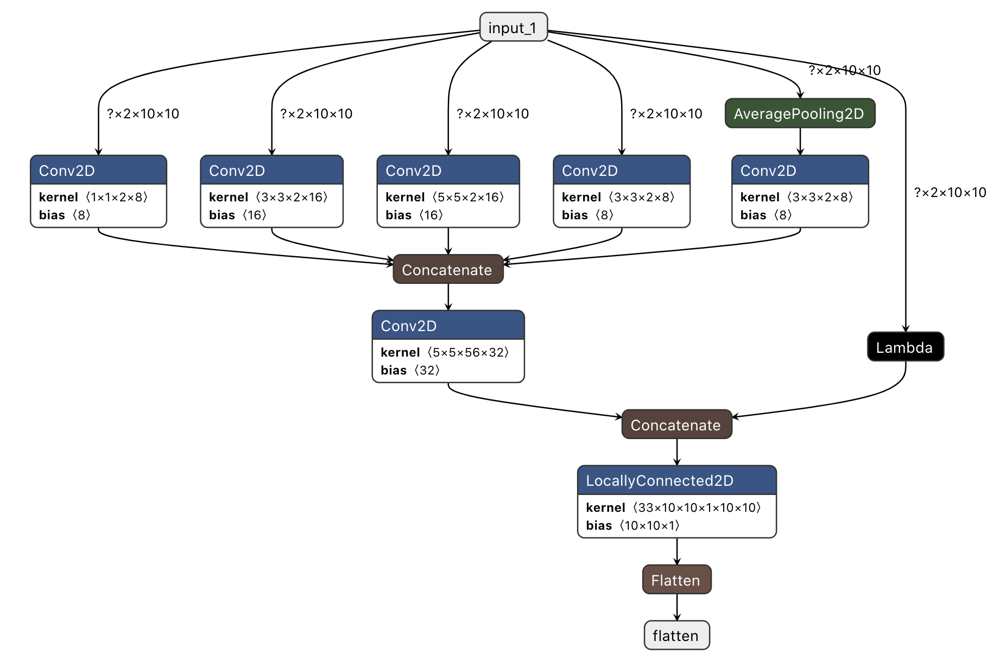

# Battleship_Modeling

## Premise
The original version of this project simply collected data on a ~60,000 battleship games and then I used Apple's CreateML to train a model. Unfortunantely I had not realized their was a bug in the ship placement causing ships to only be placed vertically. After learning alot about tensorflow and the many aspects of Machine Learning I took another stab at the project.
## The Model
Leviathan was trained on gpu's from paperspace thus it uses channels first however built into most files is a converter that will take the gpu model and switch it to cpu complient.
### Input Pipeline
The board is split into 2 channels and a 10 by 10 grid (2,10,10). Values in channel 0 are -1.0, 0.0 or 1.0. -1.0 Represents a slot that has been shot at and missed. 1.0 represents a hit on a ship of unknown class. 0.0 represents a slot that is either empty or holds a sunk ship. The second channel represents sunk ships with values 0.0, 0.2, 0.4, 0.6, 0.8 or 1.0. A value of 0.0 represents a slot which has no sunk ship within it. 0.2-1.0 correspond to each ship in ascending size, 0.2 being the supply boat and 1.0 being the carrier.
### Layers
The model uses convolutions to intially identify patterns in the data. The convolutions are then concatenated and passed through a 2d (fully connected) locally connected layer with sigmoid activation and then flattened and passed to output. There is also a lambda layer that take the input identifys what squares have been shot at using count_nonzero and return a (1,10,10) with binary values. The model is expected to have high confidence in multiple squares and is trained with multi-labels thus sigmoid is used over softmax. I use a locally connected layer here because it was *slightly* faster when using Accelerated Linear Algebra XLA versus flattening and using a dense layer, also it is more intuitive. I chose to use 'selu' activation instead of 'relu' to prevent some weights from dying at the expense of longer training times. I also experimented with using L1 and L2 constraints. L2 is used is used in the LC layer because all convolutions should have an effect on each each prediction however the more important a filter for a slot the greater impact it should have thus regularization is used to prevent overfitting.
## The Battleship Enviroment
Starting with the first iteration of the project I had set out to use Open AI Gym. It may not be the absolute fastest but it is most certainly up there. It is also a module which has been designed for reinforcment learning in the same setting I am currently engaged in. Over the developmment of the project I have tested a number of different methods to speed up the enviroment and it ultimately takes <0.8 micro secconds to setup and play a single game. Numpy and copys are used wherever is applicable to squeeze every nano seccond out of the enviroment. 
### Setting Up The Enviroment
Firstly the observation and action spaces of the enviroment are defined. Next the enviroment is seeded and some class variables are defined
### Reseting The Enviroment
Before any space can be shot at first the enviroment must be reset. First the enviroment starts by placing the ships. A random space and direction are chosen and then the space is tested to see if there are any conflicts. If there are not any the ship is placed and then placements are attempted for the next ship in the list. Once all ships are placed the observation tracker, hidState, is opened up. Lastly the omniscent multi-label tracker is setup and class variables are reset. *In summary the enviroment assumes uniform probaility of ship placement however there exists datasets on the web that show where humans prefer to place or hid their ships which I may use in future version to give the model another edge.*
### Playing the game
Shot keeping is quite simple. If a slot is empty flip it to a miss, if a slot contains a ship flip it to a hit, if it a ship is sunk flip all hit slots for that ship to sunk. Most importantly of all is if a slot is shot at twice by the model that is considered an immediate loss and the game is stopped. At the end of the move the observation, expected action, whether a hit was scored and whether the game is over is all returned to the model.
## Training
A set number of games are played. For each move in each game either a random space is chosen or a prediction is obtained from the model dependent on the Epsilon. The observation and expected prediction is recorded for every move made. These records are then shuffled, and the model is trained on batches of the data. Finally diagnostics are printed pertaining to the previous games.
## Usage
### vissualizer.ipynb
Running the vissualizer will start a single game and the model will play the game to completion. The notebook will output every move made by the model and print what it saw and the heat map of slots it may shoot at. 
### play.ipynb
The play notebook is designed for using the model live. Running the last block will return the predictions made by the model given a state in sitRep. It is up to the user to update the sitRep arrays based on the previously defined input-pipeline. The notebook will also output what is sees as well as the heatmap of predictions.
